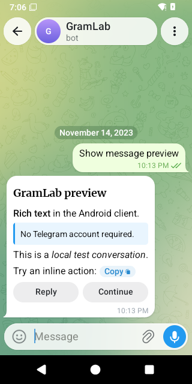

# GramLab

<p align="center">
  
</p>

[Original Android capture](docs/assets/gramlab-preview.md), with glass effects enabled.

Test Telegram bots locally and inspect their messages in the actual Telegram Android client.
No Telegram account or production token is needed.

**Experimental.** Text, callbacks, rich messages, photos, custom emoji and explicit forced-file
delivery have tested original-Android workflows. Default file classification, albums and other
parts of Telegram compatibility are still in progress.
See the [compatibility matrix](docs/compatibility/matrix.md) for the supported scope.

## Write a scenario

Create a user, talk to a real local bot, check its reply and capture the conversation:

```python
import time

from gramlab.scenario import Scenario

lab = Scenario.from_environment()
user = lab.create_user(first_name="Alex", language_code="en")
chat = lab.open_private_chat(user_id=user["id"], bot_id=lab.bots()["echo"])
lab.send_message(chat_id=chat["id"], sender_id=user["id"], text="Hello!")

deadline = time.monotonic() + 5
while len(lab.history(chat["id"])) < 2:
    if time.monotonic() >= deadline:
        raise TimeoutError("The bot did not reply")
    time.sleep(0.05)

if lab.history(chat["id"])[1]["text"] != "Echo: Hello!":
    raise AssertionError("Unexpected bot reply")
lab.capture_chat(chat_id=chat["id"], label="hello", contains=["Echo: Hello!"])
```

This runs inside a scenario process. The [English echo example](examples/echo/hello.toml) uses this exact [scenario](examples/echo/hello.py),
with the bundled bot and manifest, and the runner supplies the environment. Simulation records the conversation state;
headless Android also captures the original client. Both modes produce a local HTML report.
The Python interface is still experimental.

## Try it

Start with the [development environment](docs/development/environment.md). On a supported Linux
host with Nix and user namespaces:

```sh
nix develop
uv sync --locked
mkdir -p artifacts
uv run --locked --offline gramlab run examples/echo/hello.toml --output artifacts/echo-demo
```

Open `artifacts/echo-demo/report.html`. Use a new output directory for each run.
The runner isolates bot and scenario processes; dependency setup happens before execution.
Android captures require the separate [Android setup](docs/development/android-build.md).

More examples: [button presses](examples/inline), [rich messages](examples/rich),
[rich buttons](examples/rich_inline), and [bot restart](examples/recovery).

## Work on GramLab

- [Contributor setup and checks](CONTRIBUTING.md)
- [Current handoff and remaining work](docs/development/handoff.md)
- [Architecture](docs/architecture/overview.md) and [product scope](docs/product/requirements.md)
- [Offline execution rules](docs/development/offline-safety.md)
- [Working in parallel](docs/development/parallel-work.md)

Original core and SDK code uses [MIT](LICENSE). Two TDLib-derived Python modules retain
[BSL-1.0](LICENSES/BSL-1.0.txt). Android-derived patches and fixtures retain GPL-2.0-or-later.
See the [license map](NOTICE) and [licensing boundaries](docs/development/licensing.md).
This is a source repository. No Android APK release or completed dependency license audit is offered.

GramLab is unofficial and is not affiliated with or endorsed by Telegram.
